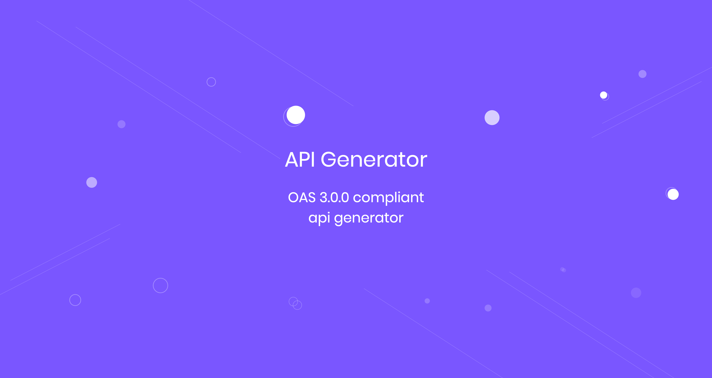

# Instantly Generate OAS 3.0 compliant APIs




## Features

- uses mongodb with mongoose ORM
- support search, sort, filter, pagination out of the box
- Generates CRUD APIs

## What it's good at

- generating an initial API
- microservice oriented
- ready to deploy (build with docker => deploy)

## What it's not good at (yet)

- idempotent changes (i.e. it doesn't know if you wrote code in there or changed things around)
- working with modified code
- populating table joins
- custom actions inside controller functions

## TODO

- generator tests
- tests for generated code
- other databases?
- **your ideas?**

## Generate api endpoint

```sh
nodemon index.js \
--type api \
--name user \
--schema ./samples/user.json \
--destination /wrannaman/generator
```


## Example Schema

```json
{
  "schema": {
    "first_name": {
      "type": "String",
      "default": ""
    },
    "last_name": {
      "type": "String",
      "default": ""
    },
    "email": {
      "type": "String",
      "trim": true,
      "required": true,
      "unique": true,
      "immutable": true, // Don't let this change from api on update
    },
    "password": {
      "type": "String",
      "trim": true,
      "select": false,
      "immutable": true, // Don't let this change from api on update
    },
    "intro": {
      "type": "Boolean",
      "default": false
    },
    "team": {
      "type": "ObjectId", // This references another collection
      "ref": "Team"
    },
    "sub": {
      "one": {
        "type": "String",
        "trim": true,
        "required": true
      },
      "two": {
        "type": "Number",
        "required": true
      }
    },
    "role": {
      "type": "String",
      "enum": ["user", "maker"],
      "default": "user"
    }
  },
  "statics": {
    "statuses": ["created", "under_review", "listed", "deleted"],
    "status": {
      "active": "active",
      "inactive": "inactive",
      "deleted": "deleted"
    }
  }
}

```


## Generated project structure

- meant to be as minimal and straight-forward as possible


    .
    ├── configs                 # config file
    ├── connection              # db connections (mongo, redis)
    ├── controller              #
    │   ├── user                # controller functions (one file, one function) create, delete, update, get, getOne
    ├── models                  # db models
    ├── router                  # endpoint routes
    ├── tests                   # @TODO
